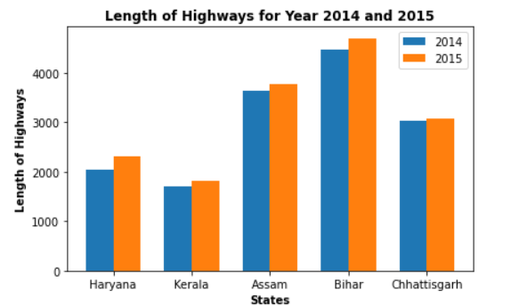
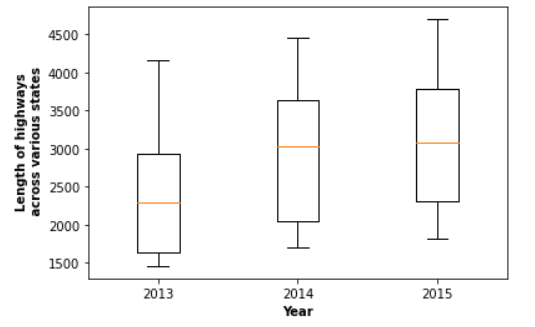
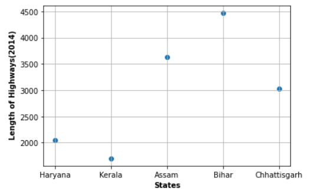

# DS200 - Module 4

**Task is described as follows:** 
 Select datasets from https://data.gov.in/ and create (a) a scatter plot, (b) a box plot, and (c) a bar or line plot from them using mathplotlib library. Upload the plots and the Python scripts you wrote to this repository as a single zip file, and include a Readme.md documentation for the same listing the data sources and the observations from the plots, including citations. Use the git or svncommand line clients to perform these operations. 
 
**Dataset Details** 
 Selected Datatest: https://data.gov.in/major-indicator/length-national-highways 
 Dataset Contains Lengths of National Highways across various states of India from year 2004 to 2015  
 **Illustration of various plots**
 

**Codes**

"""
Module4_Utkarsh_Gupta.ipynb is the jupiter notebook which can be used to generate results.

"""
